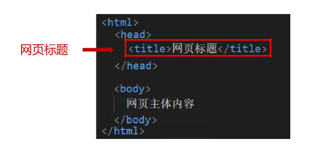
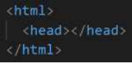
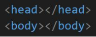

# <Central>HTML5基础</Central>

## 一、HTML概念
&emsp;&emsp;HTML 超文本标记语言——HyperText Markup Language。
 
&emsp;&emsp;超文本是什么？ 链接
 
&emsp;&emsp;标记是什么？   标记也叫标签，带尖括号的文本

## 二、标签语法
&emsp;&emsp;标签成对出现，中间包裹内容<>里面放英文字母（标签名），结束标签的前面比开始标签多 /
 
&emsp;&emsp;拓展：
 
&emsp;&emsp;&emsp;双标签：成对出现的标签
 
&emsp;&emsp;&emsp;单标签：只有开始标签，没有结束标签

## 三、HTML基本骨架

html：整个网页
 
head：网页头部，用来存放给浏览器看的信息，例如CSS
 
&emsp;title：网页标题
 
body：网页主体，用来存放给用户看的信息，例如图片、文字

## 四、标签的关系
作用：明确标签的书写位置，让代码格式更整齐

父子关系（嵌套关系）:

&emsp;&emsp;

兄弟关系（并列关系）:

&emsp;&emsp;

<strong>代码格式</strong>

&emsp;父子关系：子级标签换行且缩进（Tab键）

&emsp;兄弟关系：兄弟标签换行要对齐

## 五、注释
&emsp;&emsp;注释就是对代码的解释和说明，其目的是让人们能够更加轻松地了解代码。注释是编写程序时，写程序的人给一个语句、程序段、函数等的解释或提示，能提高程序代码的可读性。

&emsp;&emsp;在编写HTML代码时，我们经常要在一些关键代码旁做一下注释，这样的好处很多，比如：方便理解、方便查找或方便项目组里的其他程序员了解你的代码，而且可以方便以后你对自己代码进行修改。

&emsp;&emsp;<!--  内容   -- >注释标签用来在源文档中插入注释，注释不会在浏览器中显示。

## 六、路径
&emsp;&emsp;路径指的是查找文件时，从起点到终点经历的路线。

&emsp;&emsp;路径分类：
 
&emsp;&emsp;&emsp;&emsp;相对路径：从当前文件位置出发查找目标文件
 
&emsp;&emsp;&emsp;&emsp;&emsp;&emsp;/ 表示进入某个文件夹里面
 
&emsp;&emsp;&emsp;&emsp;&emsp;&emsp;. 表示当前文件所在文件夹
 
&emsp;&emsp;&emsp;&emsp;&emsp;&emsp;..表示当前文件的上一级文件
 
&emsp;&emsp;&emsp;&emsp;绝对路径：从盘符出发查找目标文件
 
&emsp;&emsp;&emsp;&emsp;&emsp;&emsp;Windows 电脑盘符出发，Windows默认是\，其他系统是/，统一写为/
 
&emsp;&emsp;&emsp;&emsp;&emsp;&emsp;Mac 电脑从根目录(/)出发

